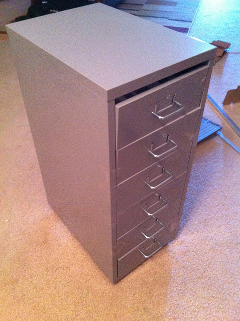
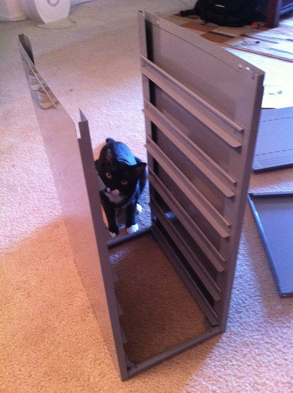
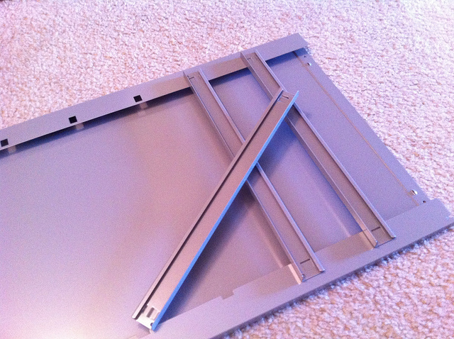

# HELMER cabinet assembly

Assembly of the HELMER cabinet is pretty much like the IKEA instructions say.
Just skip the parts where it has you assembling the drawers, you won't be
using them.  Fortunately the whole thing just snaps together without any
tools so you can disassemble parts if it makes working with it easier.

### Materials

* (10) 16" long 1/2" aluminum angle stock (see below for exact measurement)
* #8 metal screws

### Assembly

Normally the HELMER has six drawers, and thus has rails/guides for six drawers.
The top drawer position is left untouched as the whole area is used for the
power supply and switches.  This leaves the other five positions free.

This is fine if you only want to install five blades, or if you want to have
server blades with enough spacing to hold a PCIe card.  They're spaced about
3" apart vertically.

To get maximum density of 10 server blades, you'll need to add extra rails.

To do this I cut lengths of 1/2" aluminum angle stock the same length as the
existing rails. It's important that they be the same length or a hair shorter
if you intend to put doors on the cabinet, else if they stick out the doors
won't close.  I think these were either 15.5" or 16" long.

I used sheet metal screws to fasten the new aluminum rails to the lip on the
side of the cabinet in-between the existing clip-in rails. Oddly enough I
noticed the cabinet steel is pretty tough, you may need to pre-drill some
small holes through the aluminum and lip to get the screws started.

This has the effect of putting rails vertically spaced every 1.5".

Unfortunately I don't have a photo of what this looks like after it's done.

### Tips
* Assemble the doors, or at least the aluminum trim piece with the hinges
  first, and screw the hinges to the inside of the cabinet wall while you have
  it loose and laying flat.  It makes the process easier.

* The top of the cabinet just snaps on and off, this is important later when
  you need to work on the power supply or your network gear.
