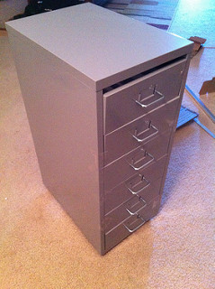
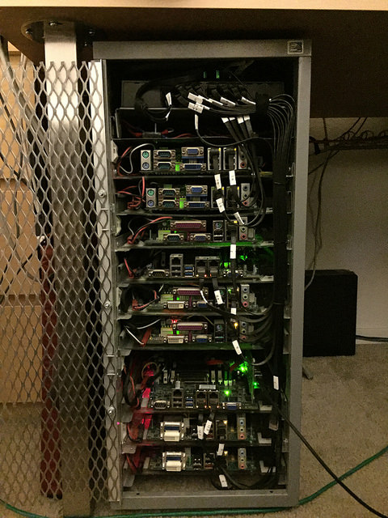
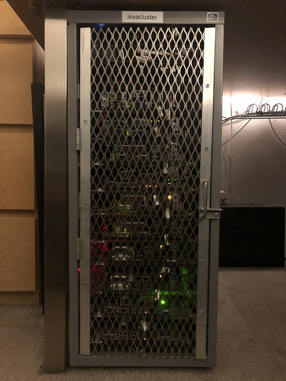

# homelab

This is ikeacluster, my take on using an IKEA HELMER filing cabinet and
turning it into a nearly silent, low power, rig for a home lab.  It supports
up to 10x mini-ITX motherboards, a mixture of 20x 2.5" or 3.5" hard drives
and/or SSDs, all running on a single ATX power supply.  Best of all, it has 
wheels and fits under a desk!

 

I first built this in 2012 and various bits have changed and expanded over
time, nevertheless it's been running nonstop 24/7 for over six years now!

Over time I hope to put together a bill of materials and halfway decent
construction doc here so people can build their own if they want.  I'm not
sure why I published this on Github instead of my own website, I guess to
be trendy.

There's room for quite a bit of improvisation and loose workmanship in
building this. Even if I built another one, it probably wouldn't be exactly
like this one.  Over on the flickrs I have a bunch of photos as this was
being built and some of the design iterations I went through.

**Lasers!**
Cutting and drilling the acrylic "blades" for motherboards+drives is a time
consuming process.  I did the originals by hand and they all had jagged edges,
but perfectly usable.  I recently got my hands on a laser cutter, so I
designed a file using Lightburn to cut out the blades perfectly.
See the Files section below or go browse through the `laser/` directory.

### Table of contents
* [FAQ](FAQ.md)
* [HELMER cabinet assembly](HELMER.md)
* [Motherboard blades](blade.md)
* [Doors](door.md)
* [Networking](network.md)
* [Power distribution](power.md)

### Files
* [Board - 2x 3.5" / 3x 2.5" drives (SVG)](laser/ikeacluster-board4-23x22x32.svg)
* [Board - 2x 3.5" / 3x 2.5" drives (Lightburn)](laser/ikeacluster-board4-23x22x32.lbrn)

### Links
* [flickr - Initial and ongoing build photos](https://www.flickr.com/photos/binaryfury/albums/72157629900950858)
* [flickr - PSU, distribution, and fan upgrade](https://www.flickr.com/photos/binaryfury/albums/72157631186725716)
* [Blog build commentary](https://binaryfury.wann.net/ikeacluster/)
* [My website!](https://binaryfury.wann.net/)

### Fully populated and running

