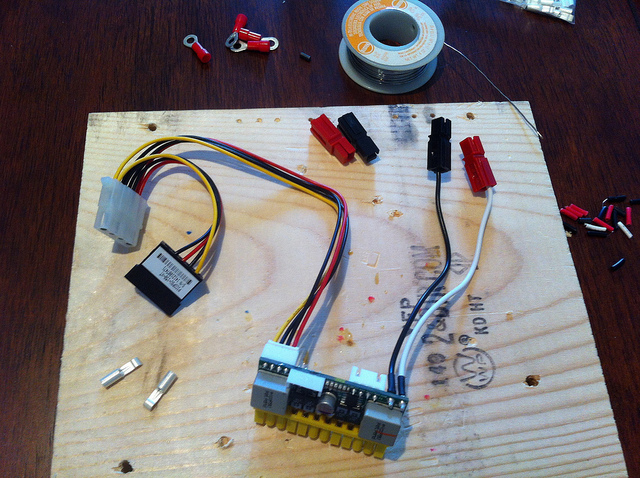
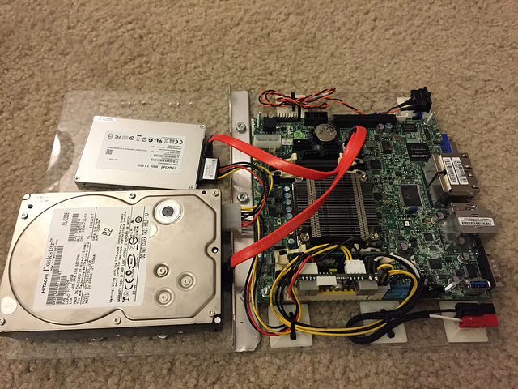
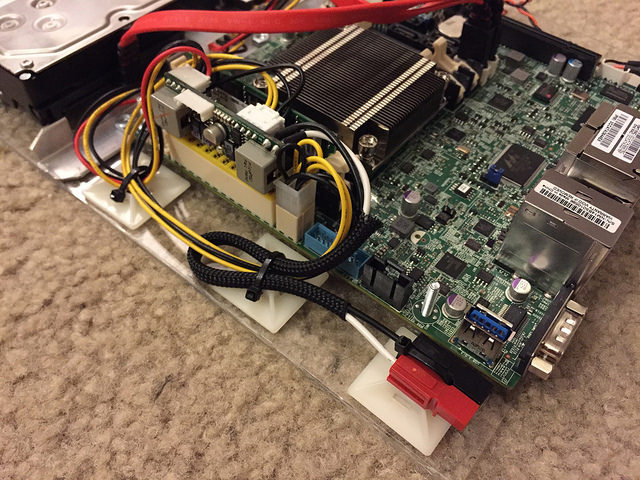
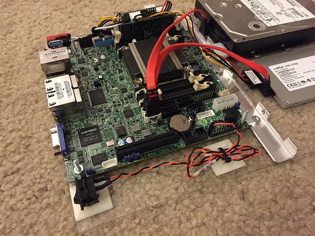
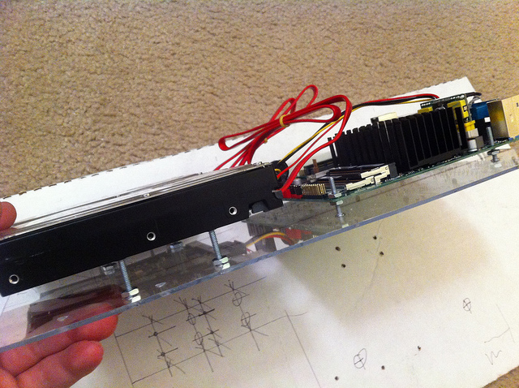
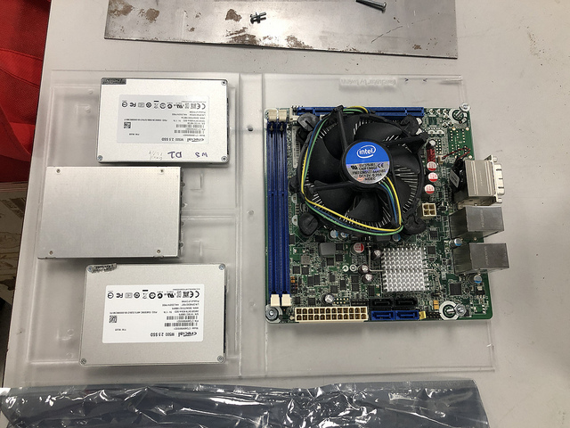

# Motherboard blade/board thingy

Each motherboard in the cabinet mounts to a 9.5" x 13.5" sheet of 1/8" thick
acrylic.

This is the maximum dimension I can use in my design to still be able to
use front and rear doors, and clear the fans on the rear door.  I use a strip
of aluminum to prevent sagging over time due to heat.

### Materials

For each motherboard in your cabinet:

* 9.5" x 13.5" x 1/8" (or .100") acrylic sheet
* #8 x 1/2" machine screws + nuts
* #6 x 1/2" machine screws + nuts (optional, for 2.5" drives)
* 9.5" x 1/2" aluminum angle stock (reinforcement bar)
* (5) 1" cable tie mounting pads
* Momentary rocker switch (power/reset button)
* Tiny zip ties
* PicoPSU (http://www.mini-box.com/DC-DC)
* Powerpole connectors
* SATA power splitter, 2/3-way (optional)
* Short SATA cables

Acyrlic usually comes in sheets of 11" x 14" or larger, so you'll need to
cut it down.  Aside from building the power wiring harness, cutting/scoring
all the acyrlic sheets with a knife, then drilling all the holes for hard
drives is easily the second most time consuming part of this project. 

This is where having access to a laser cutter helps!  If you're not lucky
enough to have access to one, you can still print out my SVG file as a
template for drilling the holes.  In the `laser/` directory I have a file
you can load into Lightburn to laser cut the bldes.

The HELMER kit contains six sheets of thin sheet metal for the drawers,
you could cut some them down and use them if you wanted to reuse some of the
material.  I used at least two of the drawers for holding the power supply
and switch, so I've opted to use the same acrylic sheets for all 10 blades.

### CPU fan warning

Since the height of a blade is limited to about 1.5", there's not a lot of
room for big CPU fans here.  On almost all of my blades I am using Intel
Atom processors which have a low TDP and use a passive heatsink with no fan.
The two older Pentium boards I have do have low-profile Dynatron 
fans+heatsinks on the CPUs.

### Motherboard power

The PicoPSU is what makes this whole project possible.  It's basically a
tiny DC-DC power supply that plugs directly into the 20/24-pin ATX power
socket on a motherboard. It takes 12 VDC in, powers the motherboard, and
has Molex+SATA connectors for a hard drive. They come in a variety of sizes,
from 90 watt to 150 watt.

Depending on the hard drives you use, you could use the Molex connector on
one drive, SATA power on another, or use a "Y" splitter for 1-3 SATA drives.

Usually the PicoPSU comes with a 3.5mm barrel connector for power input.
Because I dabble in amateur radio, I standardized a long time ago on the
Anderson Powerpole for all of my 12 volt connectors.  Here I chop off the
barrel connector and solder on Powerpole ends.  Use a couple of inches of
1/4" wire loom to help keep the power pigtail neat.

After the motherboard is mounted, I'll connect the PicoPSU, then ziptie
all the loose wires to the blade so they won't snag on anything.

(I've seen some motherboards with built-in 12 VDC connectors which could
eliminate a PicoPSU, but you're left with no way to power hard drives.)

### SATA connections

I use a couple of 6" SATA cables, preferably with a 90-degree L-ends (but
not required), between the motherboard and drive(s).  Longer is fine, it's
just more to keep tied up to stay neat.

### Mounting to the blade

For mounting the motherboard to the blade, I run machine screws (size #8)
up through the bottom of the blade for each corner of the motherboard, and
thread on a couple of nuts all the way down on each to make a crude standoff.
The motherboard holes fit over the four screws, rests on the nuts, keeping it
off the blade.  A final nut on each screw holds it down.

A piece of 1/2" aluminium angle stock (9.5" long) is bolted across the blade
for reinforcement.  I've found the board will sag over time without this,
especially when using dual hard drives, and can rub the heatsinks of the
board underneath it.

There's no need to notch the angle stock like I have in some of the photos.
It seemed like a good idea, but didn't really help anything.  Instead I
mount the upright side against the motherboard so it doesn't get in the way
of cables to the drives.

On the left side of the blade I use three 1" cable tie mounting pads to keep
the power wiring in place and zip-tie the Powerpole connector to the edge of the
blade for easy access. This is very handy as it makes the connector easier
to connect/disconnect and keeps excess wire under control.

On the right side I have mounted a momentary rocker switch for power/reset.
One mounting pad fixes the switch to the front where it's accessible, and
another helps hold the wire in place.

For each hard drive I run four machine screw (#8 x 1/2") up through the
underside of the blade, like for the motherboard.  Here I thread on a single
nut, then run the screw up into the bottom of the hard drive a few turns.  The
nut is then tightened down against the blade surface so it holds the hard
drive about a quarter inch off the blade so air can circulate around it.

For 2.5" drives, I think they need #6 1/2" screws.

The blades can handle either 2x 3.5" hard drives, 2x 2.5" hard drive/SSDs,
or 3x 2.5" HDD/SSDs.

The 3x 2.5" HDD/SSD configuration is a new design, I realized I had space on
the board to fit an extra drive so provide it as an option.  In the laser
cutter patterns they're in a "V" layout.  I figure this is better for
heat/airflow and makes it easier to get at the nuts underneath the drives.

