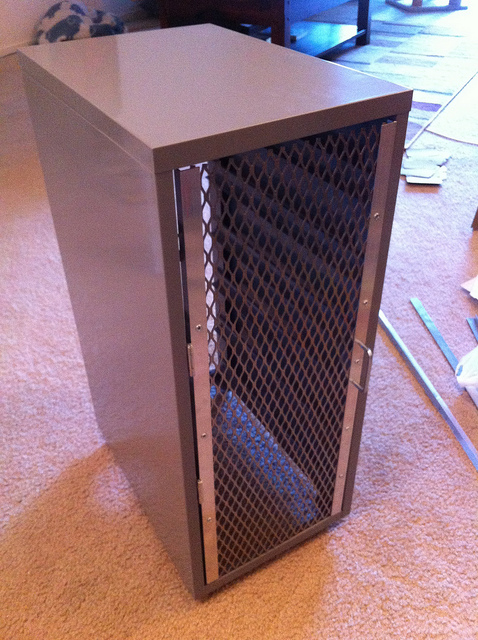
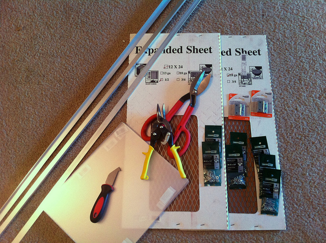
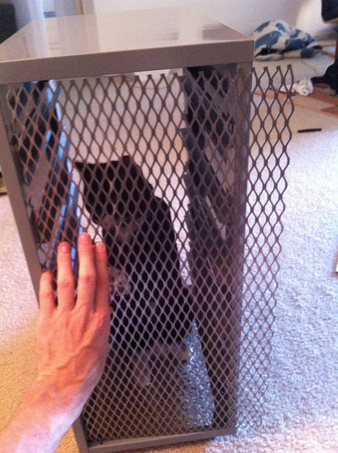
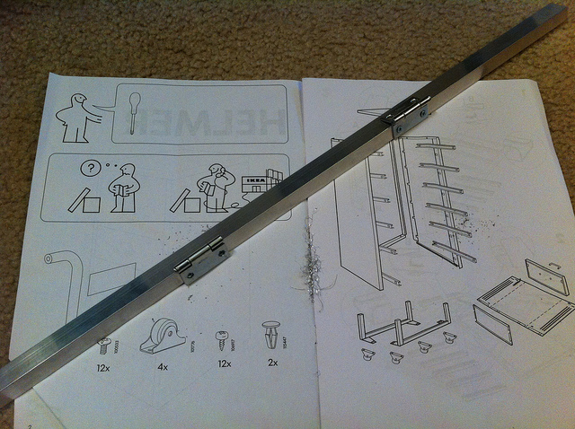
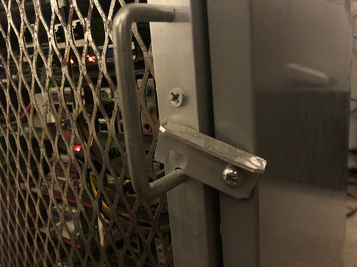
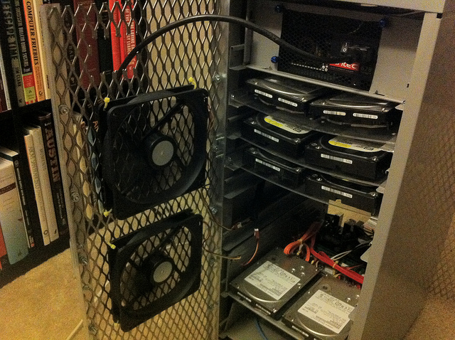

# Case doors

Doors are useful on the cabinet to keep cables contained, keep paws out, mount
fans to, and maintain a neat appearance.

I used 1/2" expanded sheet metal trimmed with 1/2" aluminum angle stock for
front and back doors.

### Materials

* (2) 9.5" x 24" 18 gauge expanded sheet metal, 1/2" mesh
* (4) 24" 1/2" aluminum angle stock (8 ft. in total)
* (4) 1.5" x 3/8" pin hinges
* #8-32 x 1/2" machine screws, flat head
* #8 washers
* #8 nuts
* #6 x 1/2" sheet metal screws, flat head
* (2) HELMER drawer handles
* (4) 140mm case fans, 2000-3000 RPM, 3-pin
* (2) Molex to 3-pin splitters

### Door assembly

This is for one door, do the same thing for the other door.

I was lucky that the hardware store I shop at has sheets of expanded metal
in 12x24" sections which helped a little with this.

Cut this down to 9.5" x 24" so it fits inside the open face of the cabinet.

Beware the new expanded metal may not be square, you may need to trim the edge
to square it up.  I used sheet metal shears to trim the excess.

Cut two (2) 24" long pieces of 1/2" aluminum stock. I used this as edge trim,
to mount hinges and a handle on, and to hide the rough edge of the sheet metal.

Using four (4) #6 x 1/2" (I think) sheet metal screws, I mounted two (2)
hinges along one piece of the aluminum stock roughly 1/4 the way down.  It is
important that the heads of the screws are flush with the thickness of the
hinges, otherwise the doors won't shut!

For mounting the trim pieces to the expanded metal, I drilled 4-5 holes
(roughly) evenly spaced across the un-hinged side of the aluminum stock. Then
used #8-32 x 1/2" machine screws (flat head) through the aluminum, through
an open mesh part of the sheet metal, with a washer and nut holding it
together.  Do this on both left and right sides.

Once the door is assembled, use #6 metal screws to attach the door to the
inside edge of the HELMER cabinet.  Again, make sure the sheet metal screws
you use are flush with the thickness of the hinge, else the door won't shut
properly.

On the side opposite of the hinge, I mounted one of the original HELMER
drawer handles as a handle to the door.

As a finishing touch, I added a simple latch to help keep the door shut.
This is very handy when you have cables inside that try to push it open!

This is a piece of 1/2" aluminum angle stock about 1.5" long.  On one end it
has a sheet metal screw through a hole that's just a bit larger than the screw
so it pivots freely. The other end has a slight notch cut in it so it will
latch over the bottom part of the HELMER handle.

### Fans

On the back door of the cabinet, I mounted four (4) 140mm fans to draw air
through the cabinet and exhaust out the back.

These are just ziptied roughly evenly along the back door, low enough from
the top so it doesn't get in the way of where the main power supply is.

Originally I used 1000 RPM fans because I was sensitive to fan noise, but
once the cabinet is stuck under a desk it's really not as noticable. I later
swapped these out for 2000 RPM (that's all Fry's had), and I think 3000 RPM
may be okay.

For fan power, I used a molex connector off the main PSU, to a couple of
3-pin splitters, then down to the four fans.  There's no speed control here,
they run full speed all the time while the cabinet is powered up.
