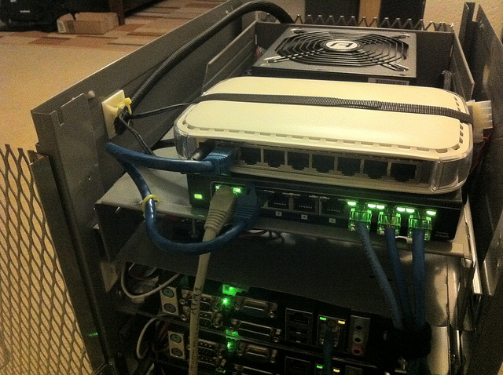
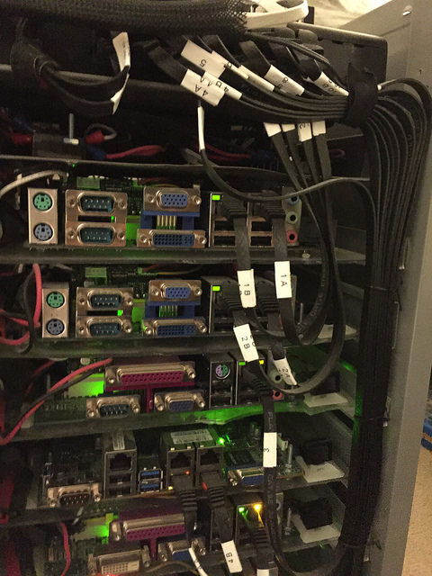

# Networking

The physical dimensions of the HELMER cabinet make the selection of switches
and routers tricky.  To fit within the cabinet they can not be any wider than
10" and really not any deeper than about 7".  This usually means you're
looking at 8-port switches, but we have the capacity for 10 systems, hmm.

The networking of my setup has changed considerably over the years, adding
more complexity to keep up with real world environments.  You can install
a switch here and call it done if you want!

### Material list

* D-Link DGS-1016A switch
* Ubiquiti ER-X or ER-6P router (optional)
* 1/2/3' pre-made flat cat 5e patch cables

### Switches and router

Originally I used a pair of 8-port Netgear gigabit switches daisy-chained
together:

As of 2014 I found exactly two 16-port gigabit switches that physically fit
within the HELMER.  One is the D-Link DGS-1016A (which I still use today),
and the other was a Zyxel GS1100-16.

With 16-ports this gives me the ability to do Ethernet bonding/NIC teaming
to some of my systems that have dual/quad Ethernet on the motherboard.

In this photo I also have a Ubiquiti ER-X router installed along with the
D-Link switch.  This lets me treat the entire ikeacluster as a seperate layer 3
network away from my normal home network.

Today I use a Ubiquiti ER-6P router because I wanted more uplinks to an
intermediate router for testing.

### Cabling

Originally I used custom made cat5 cables to go from the switches to the
individual motherboards.  These proved to be bulky and made the door not
close well.  Since then I've bought pre-made cat5e cables in lengths of
1', 2', 3'. These are much better because they can be bundled tightly
together and stay out of the way of removing blades and keeping the door
shut.

Ethernet and power from the switch and router go out through the back door.

### Topology

This can be whatever you want it to be to suite your own needs and preference.

In my setup the entire ikeacluster is treated as a rack in a datacenter
with a layer 3 top-of-rack switch.  Within the cluster there's a single
IPv4 /24 and a single IPv6 /64 for all of the systems.  As a L3 setup,
I also have BGP running between it and my other home router.

If it weren't for HBase (for OpenTSDB) and some of the older motherboards
that don't do UEFI IPv6 PXE booting, I would be 100% IPv6-only.  The cluster
is dual-stacked with IPv4 and IPv6, but the vast majority of traffic is IPv6.
