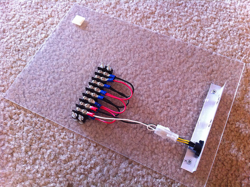
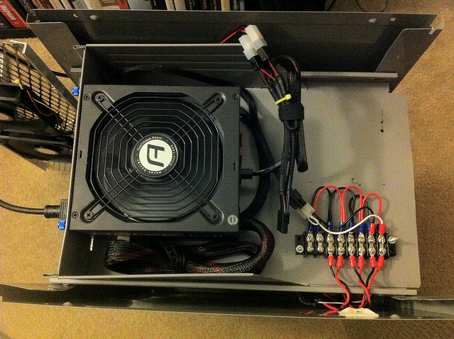
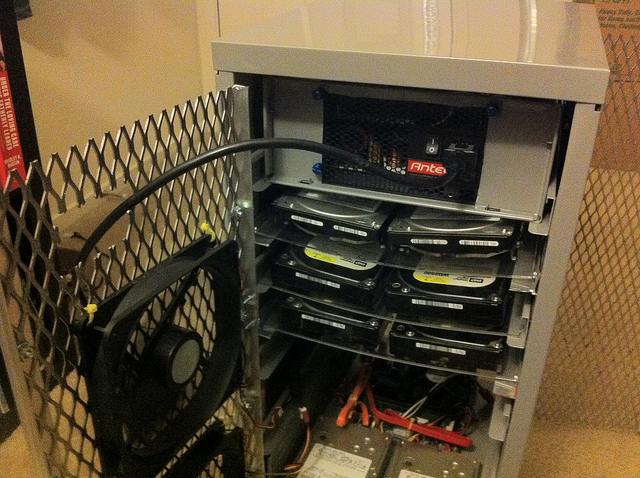
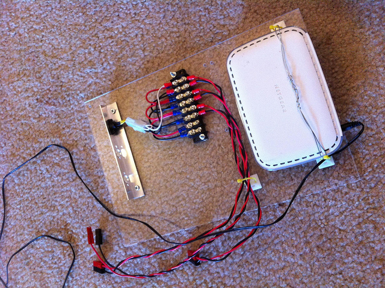
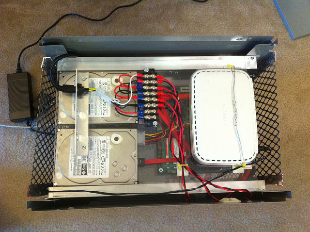
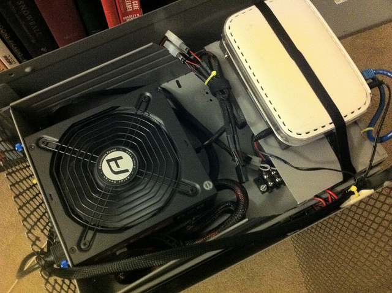
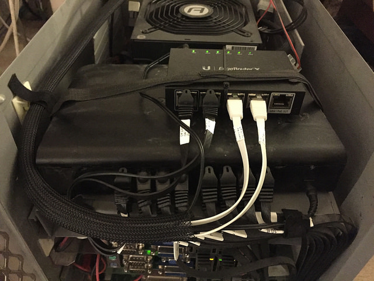
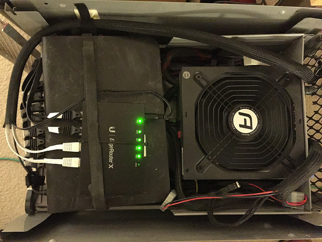

# Power distribution

All of the server blades in ikeacluster are powered by a single 620 Watt ATX
power supply unit (PSU).  This provides 12 VDC out to a power distribution
block, to the PicoPSUs in each individual motherboard.  A "power supply
terminator" on the ATX PSU keeps it always-on.

Originally I used 12 VDC power supplies from surplus, but the largest I
could get my hands on was 192 watt.  Beyond this they just got too expensive,
so why not just use an ordinary $90 ATX "gamer" PSU?  It provides a lot
of 12 volt power, is compact, and has a fan.

**Original DIN -> power block:**

**Current ATX PSU in cabinet:**

Using a modular/semi-modular power supply was important to get rid of
excess cabling that I just didn't have room for.

### Materials
* Antec 620 W ATX power supply unit
* ATX power supply terminator (e.g. https://www.frys.com/product/6489932)
* (2) HELMER drawers
* (2) 8-position barrier terminal blocks (10-pos if you can get it)
* (4) #8 1" machine screws + nuts (for terminal blocks)
* (2) Barrier terminal block covers (or make your own from acrylic)
* (40) 22-18 AWG insulated ring terminals
* (~20 ft) 18 AWG cable, red
* (~20 ft) 18 AWG cable, black
* (~15 ft) 1/4" wire loom
* (20) Anderson Powerpole connectors (10 red, 10 black)

### Power assembly

I'm not entirely satisified with how I built this, it could be done better.
Cutting the cabling for individual blades, crimping the ring terminals, and
soldering on the Powerpole connectors is easily the most time consuming part
of this project.  Cutting and drilling all the acrylic sheets is a close
second.

The entire top drawer slot of the HELMER is occupied by the PSU, terminal
blocks, the Ethernet switch, and router.  (See photo above.)

I used one of the HELMER drawer assemblies here, leaving off the front panel,
and trimming back the sides.  The rear panel of the drawer has a cutout for
the power supply and notches for thumbscrews holding the PSU to the panel.

I used a sheet metal screw to fasten the drawer to the side of the cabinet so
it can not slide out.

**Rear view:**

The fan of the PSU is a nice side effect of drawing air over the switch and
router, and any residual heat out of the top of the cabinet.

In the front of the drawer, two 8-position terminal blocks are bolted down
side by side. One side of each terminal block has daisy chained jumpers for
input power. The other side of the block is where cabling to individual server
blades terminate.  Protect the terminal blocks from accidental electrical
shorts with a cover or put a small sheet of acyrlic over them.

### Power supply connections

From the PSU, these connectors are used:
* 24-pin ATX connector -> terminator, so the PSU is always-on
* 4-pin ATX connector -> input side of terminal block #1 (pos. and neg.)
* 4-pin ATX connector -> input side of terminal block #2 (pos. and neg.)
* Molex connector -> 3-pin splitter to case fan #1 and #2 on rear door
* Molex connector -> 3-pin adapter to case fan #3 on rear door

The 24-pin connector cable is folded up and tucked alongside the PSU to keep it
out of the way.

### Power to blades

This is an older photo, but shows an example of the power cables that run from
the terminal blocks to the individual server blades:

From the terminal block to the PicoPSUs on individual blades is a length of
red+black 18 gauge wire.  The wires will vary in length for each blade, e.g.
the wires for the top blade will be about 1' long, wires for the bottom
blade will be about 3' long.  One end has a pair of ring terminals, the other
end is a pair of red+black Powerpole connectors.  Use 1/4" wire loom along the
entire length to keep it neat.

Because I only had 8-position terminal blocks this meant that only 4 blades
could nominally be attached to each, so I had to double up a couple of
positions to run power for all 10 blades.

You might as well assemble all 10 cables now even if you don't use them all,
because it'll be easier to run now than later.

All 10 cable pairs can be ran down the left side of the cabinet, between the
cabinet side and the drawer guides. This keeps them out of the way of sliding
out individual blades.

Another old photo, but shows how the cabling is ran down the inside of the
cabinet from a terminal block:

# Switch shelf

In the front half of the HELMER drawer used to hold the power supply, I use
the space above the terminal blocks for the switch(es) and router.

This makes things dense in the front, and if you're stacking switches or a
router, it makes the ports from the upper device inaccessible from the front.
Fortunately, it's easy to take the top off the cabinet to get to the wiring
if needed.

Using the bottom from a second HELMER drawer, I cut it down to about 4-5" deep,
trimmed the sides down to about 1.5", formed it into an inverted-"U", and fit
it over the front of the other drawer.  This covers the terminal blocks and
provides a surface to mount the switch on.  I used long lengths of hook and
loop strap to hold things down.

This is a recent view of the front of the switch shelf, the router is under
the lid of the cabinet:

View of the top of the cabinet before putting the lid on:

